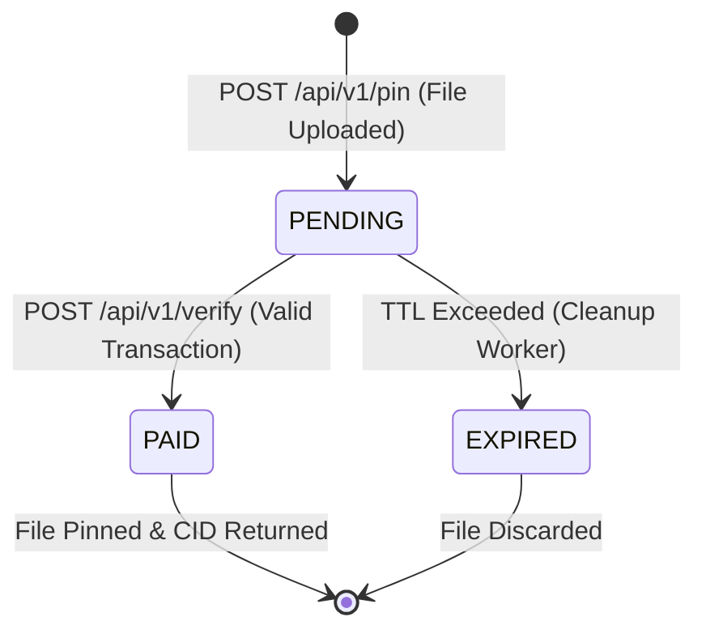

# Data Model: AB-PP-002 (x402 Dynamic Payment Challenge & Local Verification)

This document defines the data structures, schemas, and state transitions for the Pay-to-Pin gateway payment challenges.

## 1. Core Entities

### Challenge

Represents an active, unpaid payment challenge issued to a client.

| Field Name | Type | Description | Validation / Constraints |
|---|---|---|---|
| `reference_id` | String (UUIDv4) | Unique tracking ID for the challenge | Primary Key, UUID format |
| `filename` | String | Original filename of the uploaded payload | Max 255 chars |
| `content` | Bytes | Raw binary content of the uploaded file | Not null |
| `size` | Integer | Size of the file in bytes | Must be > 0 |
| `amount` | Integer | Required payment in microALGOs | Computed via pricing contract rates |
| `escrow_address` | String | Escrow account where funds must be sent | Valid Algorand 58-character address |
| `status` | String (Enum) | Current lifecycle status | `PENDING`, `PAID`, `EXPIRED` |
| `created_at` | DateTime | Timestamp when challenge was generated | Defaults to current time |

### PinVerificationRequest

Schema for client submission to finalize the pinning process.

| Field Name | Type | Description | Validation / Constraints |
|---|---|---|---|
| `reference_id` | String (UUIDv4) | Reference ID of the associated challenge | Must exist in `challenges` cache |
| `tx_id` | String | Algorand transaction ID proving payment | Valid Algorand transaction ID format (52-character base32) |

---

## 2. State Transition Flow

### Transition Triggers & Validation Rules

1. **Upload (`[*]` -> `PENDING`)**
   - File size is computed.
   - Pricing contract is queried (or cached rates used) to obtain `base_price` and `byte_price`.
   - `amount` is calculated: `base_price + (size * byte_price)`.
   - `reference_id` is generated using UUIDv4.
   - The file payload and metadata are stored in-memory under `reference_id`.
   - Returns HTTP 402 with challenge details.

2. **Verification (`PENDING` -> `PAID`)**
   - Client sends `reference_id` and `tx_id`.
   - Check if `reference_id` exists and is `PENDING`.
   - Validate that `tx_id` has not been used before (reject double-spend).
   - Fetch transaction details from the Algorand blockchain (or mock client).
   - Verify transaction fields:
     - `type` is payment (`pay`).
     - `receiver` matches `escrow_address`.
     - `amount` matches or exceeds challenge `amount`.
     - `note` (decoded) matches `reference_id`.
     - `confirmed-round` is greater than 0.
   - Update challenge status to `PAID`.
   - Trigger IPFS pin, return CID, and remove temporary file from cache (or archive metadata).

3. **Expiration (`PENDING` -> `EXPIRED`)**
   - Background clean-up evicts challenges older than the configured TTL (e.g., 10 minutes) to free memory.
