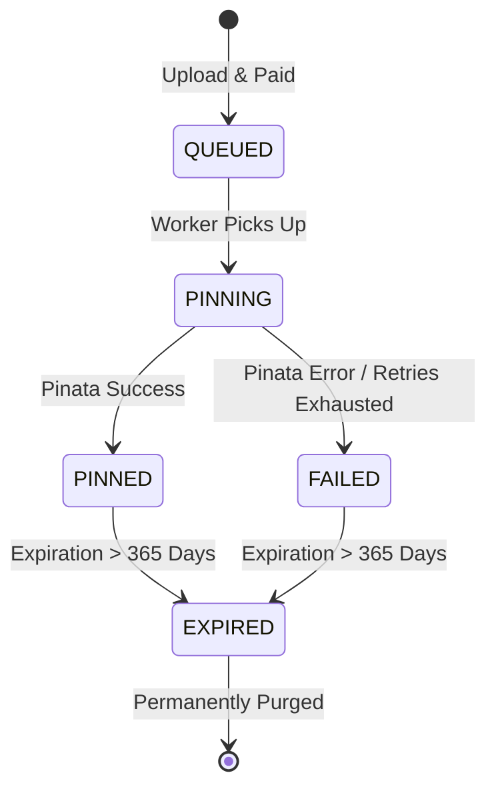

# Data Model & Configuration Schema

## Data Model Extensions & Entities

### Container Environment & Configuration (`.env`)

| Property | Type | Description | Required | Default |
| :--- | :--- | :--- | :--- | :--- |
| `PORT` | Number | App listening port inside container | No | `4021` |
| `ALGORAND_NETWORK` | String | Target Algorand network (`mainnet` or `testnet`) | Yes | `testnet` |
| `ALGORAND_SERVER` | String | Algod API node endpoint | Yes | `https://testnet-api.algonode.cloud` |
| `ESCROW_ADDRESS` | String | Algorand address for microUSDC payment settlement | Yes | — |
| `PINATA_JWT` | String | Pinata API bearer token for IPFS pinning | Yes | — |
| `SUPABASE_URL` | String | Supabase PostgreSQL project URL | No | — |
| `SUPABASE_KEY` | String | Supabase API key | No | — |
| `DUCKDNS_SUBDOMAIN` | String | DuckDNS subdomain name | Yes | — |
| `DUCKDNS_TOKEN` | String | DuckDNS account token | Yes | — |
| `ALLOW_LOCAL_FALLBACK` | Boolean | Enable local disk buffer fallback | No | `true` |

### Queue Item Lifecycle State Machine (`QueueItem`)



### Atomic File Write Interface Contract

```typescript
export interface AtomicFileSaver {
  saveAtomic(filePath: string, data: string): Promise<void>;
}
```
