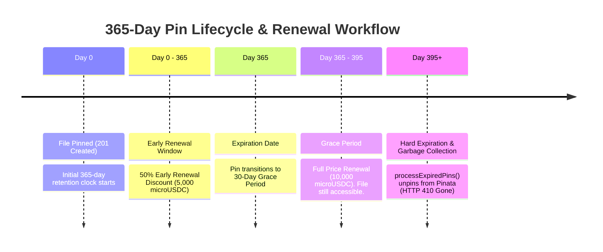

# 365-Day Retention, Pinata Unpinning & Economic Renewal Proof
**Project**: IPFS Pay-to-Pin Gateway  
**Specifications**: `specs/007-timeboxed-retention-renew`

---

## 1. Executive Summary & Economic Model

In decentralized storage, promising "forever storage" for a single one-off payment is a dangerous financial liability. As storage nodes run continuously, un-renewed legacy files accumulate endlessly, increasing infrastructure costs without generating revenue.

The **IPFS Pay-to-Pin Gateway** enforces a **365-Day Timeboxed Retention Model** with annual micropayment renewals. This design:
1. Prevents abandoned data from accumulating on Pinata nodes.
2. Frees up cloud file storage automatically after a 30-day grace period.
3. Requires recurring economic activity (microUSDC payments) to keep pins active.

---

## 2. Retention & Renewal Lifecycle Timeline



---

## 3. Detailed Phase Breakdown & Economic Rules

### Phase 1: Initial Pinning (Day 0)
- Client posts file payload (`POST /api/v1/pin`) and settles microUSDC payment.
- Server returns `201 Created` with retention metadata:
  ```json
  {
    "status": "success",
    "filename": "grey_box_test.png",
    "ipfs_cid": "bafybei...",
    "pinned_at": "2026-07-31T10:00:00.000Z",
    "expires_at": "2027-07-31T10:00:00.000Z",
    "ttl_days": 365,
    "renewal_url": "/api/v1/renew"
  }
  ```

### Phase 2: Early Renewal (Day 0 to Day 365 — 50% Discount)
- Any client/agent can extend retention at any time during the active 365 days.
- **Discount Structure**: Early renewals receive a **50% Discount** on microUSDC pricing.
- **Expiration Extension**: `expires_at` is extended by **+365 days from the previous expiration date** (`expires_at = previous_expires_at + 365 days`), preventing any loss of paid days.
- **Code Logic** (`src/queue.ts`):
  ```typescript
  const baseTime = item.expires_at > now ? item.expires_at : now;
  item.expires_at = baseTime + 365 * 24 * 60 * 60 * 1000;
  item.renewalsCount += 1;
  ```

### Phase 3: Grace Period (Day 365 to Day 395 — Standard Price)
- If unrenewed by Day 365, the file enters a **30-Day Grace Period** (365 to 395 days total).
- `GET /api/v1/pin/:cid` returns:
  ```json
  {
    "is_active": false,
    "days_remaining": 0,
    "renewals_count": 0
  }
  ```
- Renewals during the grace period require **100% standard pricing** (10,000 microUSDC). The new 365-day retention clock starts from `NOW`.

### Phase 4: Hard Unpinning & Garbage Collection (Day 395+)
- When `NOW > expires_at + 30 days` (395 days total), the background worker (`processExpiredPins()`) automatically unpins the file from Pinata.
- **Code Implementation** (`src/queue.ts` & `src/storage.ts`):
  ```typescript
  public async processExpiredPins(): Promise<void> {
    if (this.isProcessingExpired) return;
    this.isProcessingExpired = true;

    try {
      const items = await this.getItems();
      const now = Date.now();

      for (const item of items) {
        if (item.status === 'PINNED') {
          const gracePeriodEnd = item.expires_at + 30 * 24 * 60 * 60 * 1000;
          if (now > gracePeriodEnd) {
            console.log(`[Queue Worker] CID ${item.cid} exceeded grace period. Unpinning...`);
            await unpinFileFromIPFS(item.cid); // Executes DELETE request to Pinata API
            item.status = 'FAILED';
          }
        }
      }
    } finally {
      this.isProcessingExpired = false;
    }
  }
  ```
- **Pinata Unpin API Call** (`src/storage.ts`):
  ```typescript
  await axios.delete(`https://api.pinata.cloud/pinning/unpin/${cid}`, {
    headers: { Authorization: `Bearer ${pinataJwt}` }
  });
  ```
- **Result**: The file is permanently removed from Pinata, freeing up account file storage limits. Subsequent requests to `/renew` return `HTTP 410 Gone`. To re-pin the file, the user/agent must submit a fresh POST upload request with full payment.

---

## 4. Test Verification Evidence

The retention and unpinning logic is verified by unit and integration tests in `tests/queue.test.ts`:

1. **`T007`**: Verifies initial 365-day `pinned_at` and `expires_at` ISO timestamps upon job creation.
2. **`T011`**: Verifies `renewPin()` extends `expires_at` by +365 days from previous expiration when active, and from `NOW` when expired.
3. **`T015b`**: Verifies `processExpiredPins()` calls `unpinFileFromIPFS(cid)` and updates status to `FAILED` once `now > expires_at + 30 days`.

---

## 5. Pinata Manual Cleanup Utility

To manually clean up test files from Pinata at any time during development or testing, use the provided helper script:

```bash
# Unpin one or more CIDs from Pinata
npx tsx scripts/cleanup-pin.ts <CID_1> <CID_2>
```

**Example**:
```bash
npx tsx scripts/cleanup-pin.ts bafybeicg42xxyz...
```
