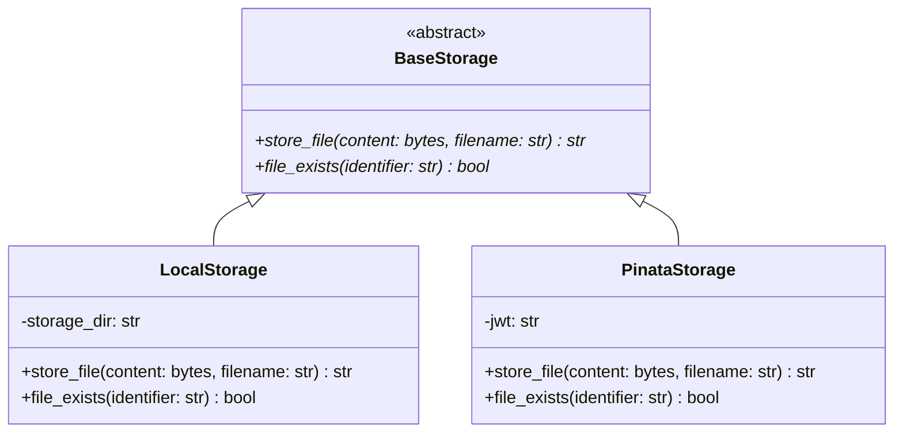

# Data Model: Pluggable Storage & Mock Adapter (AB-PP-003)

This document describes the key structural interfaces, class hierarchies, and configuration models introduced for pluggable storage support.

## 1. Class Hierarchy



### 1.1 `BaseStorage` (Abstract Interface)
- **Role**: Base interface defining contracts for storage engines.
- **Methods**:
  - `store_file(content: bytes, filename: str) -> str`: Write bytes, return unique string ID (e.g. CID).
  - `file_exists(identifier: str) -> bool`: Query if file metadata/content is present.

### 1.2 `LocalStorage` (Local Mock Implementation)
- **Role**: Development/test storage simulator.
- **Attributes**:
  - `storage_dir` (str): Configured filesystem path where mock files are stored.
- **Behavior**:
  - Automatically creates `storage_dir` on initialization if not present.
  - Generates content-addressed names using base32 encoded SHA-256 hashes of the file contents to mimic IPFS CIDs (e.g., `bafybeih...`).
  - Writes actual content to `storage_dir/<cid>`.
  - Persists file mapping information (e.g., filename metadata) in a JSON index file (e.g., `index.json`) or stores the metadata side-by-side (e.g., `storage_dir/<cid>.metadata.json`). Let's store metadata side-by-side or inside the file structure.

---

## 2. Configuration Settings Model

The following settings are added to `gateway/config.py` (via Pydantic or basic `Settings` wrapper):

| Setting | Type | Default | Description |
|---------|------|---------|-------------|
| `STORAGE_PROVIDER` | `str` | `"local"` | Active engine: `"local"` or `"pinata"`. |
| `LOCAL_STORAGE_DIR` | `str` | `"tmp/mock_storage"` | Directory on local disk where files are saved when `STORAGE_PROVIDER` is `"local"`. |

---

## 3. Challenge Cache Data Structure Update

The existing memory-based `challenges` dictionary in `gateway/main.py` is updated to integrate storage verification:

```python
challenges[ref_id] = {
    "content": bytes,
    "filename": str,
    "size": int,
    "price": int,
    "paid": bool,
    "created_at": float
}
```
No relational database changes are required for this iteration as the gateway uses an in-memory cache (`challenges` and `spent_txns`) for active challenges.
